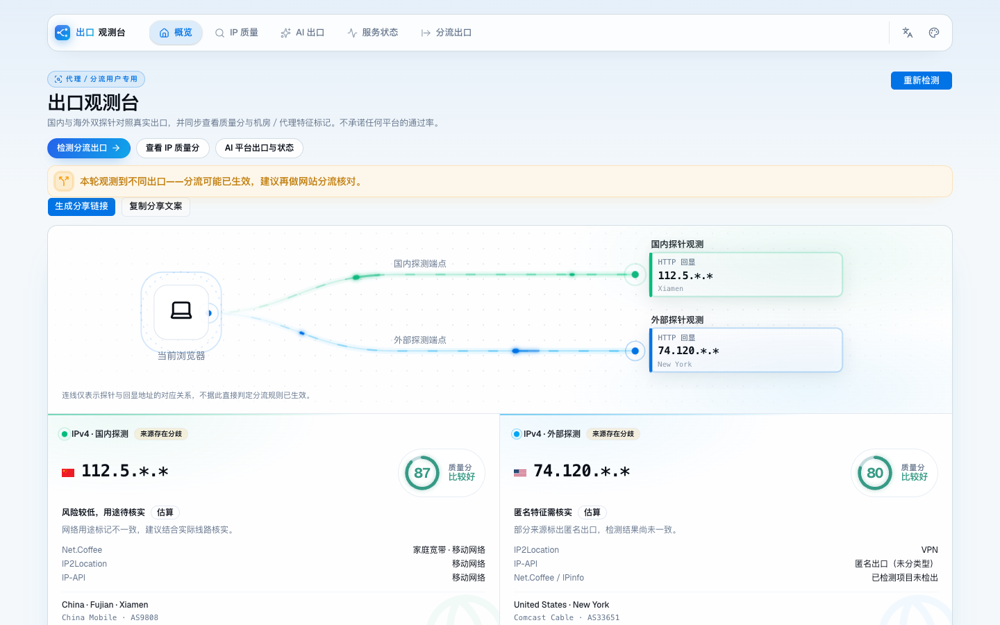
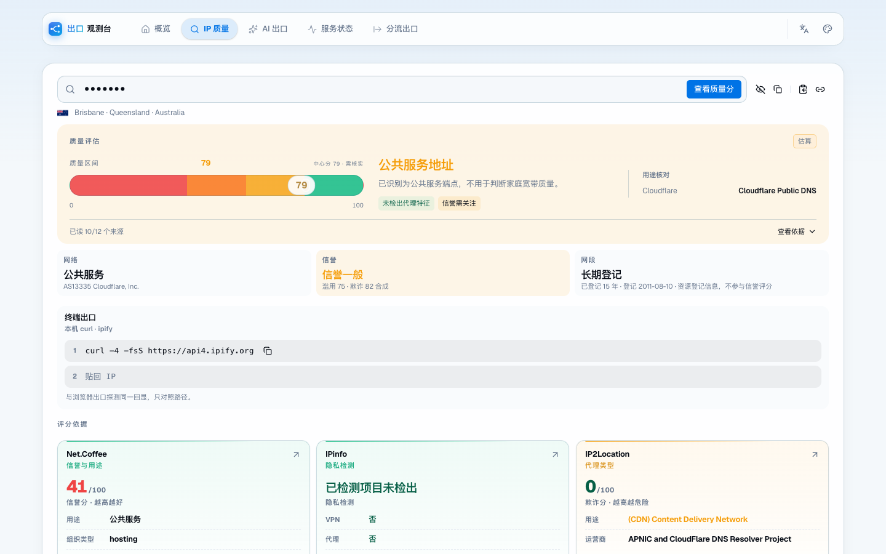
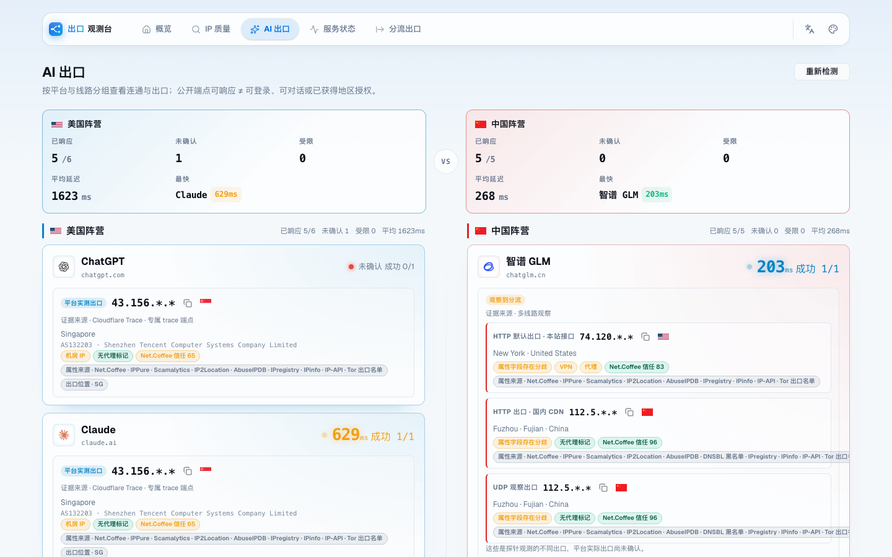
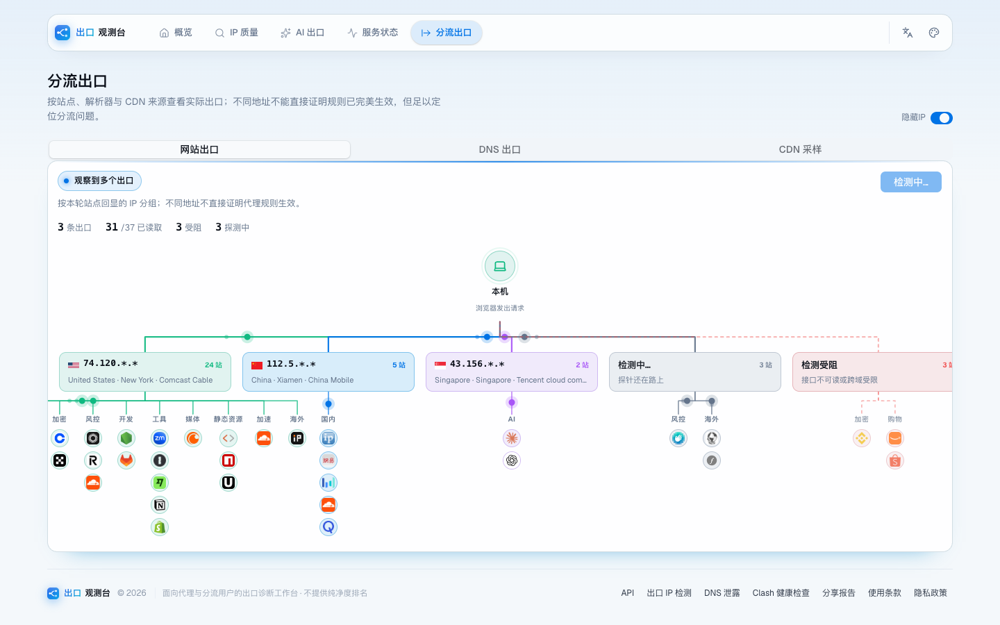
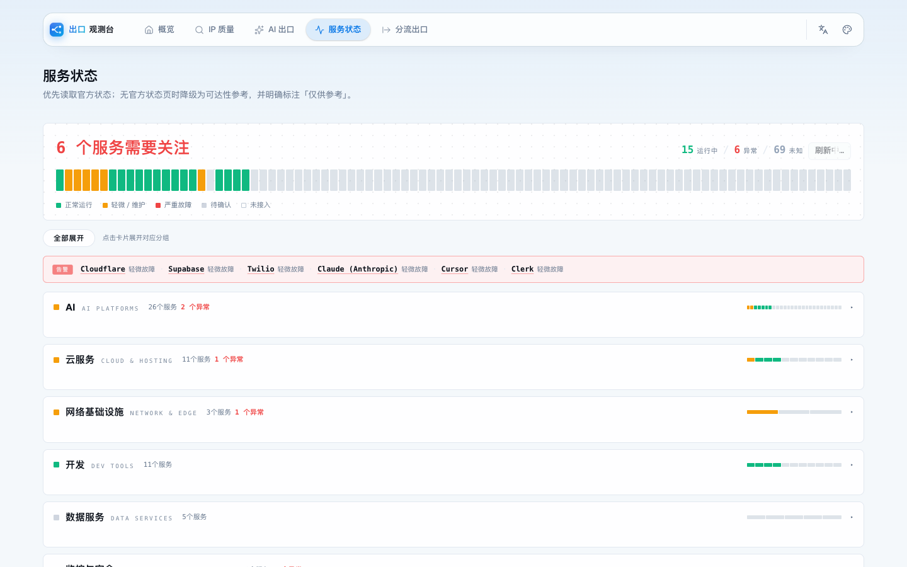

# 出口观测台 EgressScope

**中文** · [English](README.en.md)

自托管的出口诊断工作台，面向使用代理与分流配置的用户。对照国内外出口是否按预期分流，检查 WebRTC／DNS 泄露，给出口 IP 打质量分，并聚合常用 AI 服务的连通性与官方状态。

纯前端 SPA（React 19 + Vite）加 **Cloudflare Workers** 后端，无账号、无数据库，基础功能开箱即用。

**在线体验**：[ip.gogoxy.com](https://ip.gogoxy.com)

## 它能做什么

- **出口对照**：国内与海外双视角观察同一目标的实际公网出口，按网站、DNS、CDN 拆分，核对分流规则是否生效
- **泄露检查**：WebRTC/STUN 的 UDP 候选与网页出口比对，DNS 解析出口定位
- **IP 画像**：IPv4/IPv6 归属、ASN、CIDR、多源位置对比，机房/住宅/移动/VPN/代理/Tor/滥用标记与 0–100 质量分
- **网络测量**：Globalping 全球探针延迟与丢包、HTTP 多轮采样
- **注册资料**：域名、IP、ASN 的 RDAP 查询与原始响应
- **平台状态**：ChatGPT、Claude、Grok、Perplexity、Gemini、DeepSeek、通义千问、Kimi 的连通性与官方状态聚合
- **分享报告**：一键生成出口一致性快照链接（需要可选 KV 存储）
- **使用体验**：中英文、深浅色多主题、移动端适配、查询历史、二维码分享

第三方源的限流与跨域限制会影响结果；HTTP 耗时与 ICMP Ping 口径不同。IP 类型和信誉分仅供参考，不代表任何平台官方判定。

## 界面预览

| 概览 · 国内外出口对照                      | IP 质量 · 归属与评分                        |
| ------------------------------------------ | ------------------------------------------- |
|  |  |

| AI 出口 · 平台连通与实测出口               | 分流出口 · 网站出口拓扑                      |
| ------------------------------------------ | -------------------------------------------- |
|  |  |

服务状态页聚合近百个 AI 与云服务的官方状态：



## 部署到 Cloudflare

[](https://deploy.workers.cloudflare.com/?url=https%3A%2F%2Fgithub.com%2Furuana33%2Fegress-scope)

或手动接入 Workers Builds：

1. [Fork 本仓库](https://github.com/uruana33/egress-scope/fork)
2. Cloudflare 控制台 → **Workers & Pages** → 创建 Worker → 导入 Git 仓库，选中你的 Fork
3. 构建命令 `pnpm build`，部署命令 `pnpm run deploy`；Node.js 24 + pnpm 10.32.1，根目录保持默认
4. 生产分支 `main`，部署后访问分配的 `workers.dev` 地址；自有域名在 Worker 设置中绑定

`main` 有新提交时自动构建部署。`/api/*` 走 Worker，其余为静态资源。

### 可选配置

不加也能跑；配置后对应数据源自动启用：

| 变量                 | 启用效果                                                      |
| -------------------- | ------------------------------------------------------------- |
| `IPQS_API_KEY`       | IPQualityScore 欺诈分 / 匿名旗标 / 用途                       |
| `ABUSEIPDB_API_KEY`  | AbuseIPDB 滥用置信度 / 举报数                                 |
| `IPREGISTRY_API_KEY` | 自有 key 查 IPregistry；未配置时回退站点公开 demo key（限流） |
| `MXTOOLBOX_API_KEY`  | 有网络查询额度时经 MXToolbox 读黑名单，否则直接查公开 DNSBL   |
| `TIANDITU_TOKEN`     | 地图优先天地图（国内更稳），未配置或不可用时 OpenStreetMap    |

Worker → Settings → Variables and Secrets 以 Secret 添加，不用改代码。

分享报告（`/api/report`、`/r/{id}`）依赖 KV：`pnpm exec wrangler kv namespace create REPORTS` 拿到 id，填回 `wrangler.toml` 里注释着的两段 `kv_namespaces`。未绑定时这两个接口返回 503，其余功能不受影响。

## 本地开发

```bash
pnpm install --frozen-lockfile
pnpm worker:dev    # Vite + 本地 Worker，打开 http://127.0.0.1:8787
```

```bash
pnpm build         # 类型检查 + 生产构建
pnpm test          # Worker dry-run + Node 测试
pnpm lint
pnpm run deploy    # 发布 dist（先 wrangler login）
```

## HTTP API

免 Key 的出口健康度接口：

```bash
curl -fsS 'https://你的域名/api/ip/health?ip=1.1.1.1'               # JSON（默认）
curl -fsS 'https://你的域名/api/ip/health?ip=1.1.1.1&format=text'   # 终端文本
curl -fsS 'https://你的域名/api/ip/health'                          # 省略 ip：查调用方出口
```

返回 `ip`、`checked_at`、`score`、`status`（75–100 `good`，45–74 `moderate`，<45 `poor`，缺失 `unknown`）、位置、ISP、ASN 与 `flags`。错误统一 `{ "error": "…" }`：400 参数、429 限流、503 无法识别出口、502 上游故障。本地 `:8787` 必须带 `ip`；响应不缓存。

## CI 部署（可选）

Workers Builds 和 GitHub Actions 二选一。Actions 默认只构建+测试，要接管部署在仓库 Actions 设置中添加：

| 类型     | 名称                    | 用途                       |
| -------- | ----------------------- | -------------------------- |
| Variable | `ENABLE_CF_DEPLOY=true` | 开启部署                   |
| Secret   | `CLOUDFLARE_API_TOKEN`  | 目标账户的 Worker 部署凭证 |
| Secret   | `CLOUDFLARE_ACCOUNT_ID` | 目标 Cloudflare 账户 ID    |

推送 `main` 或手动运行 `Build and deploy egress-scope`。外部 PR 只跑测试，拿不到凭证。

## 目录与数据来源

- `src/views/`：各功能页面（出口、IP、DNS、WebRTC、AI、状态、文档）；`src/components/ui/`：shadcn/ui；`src/app.css`：样式
- `public/worker/`：Worker API；`tests/`：Node 测试
- 数据源：Net.Coffee（IP 详情）、Globalping（全球测量）、IANA/RDAP（注册资料）、各平台官方状态接口
- Claude 环境检测字典来自 [LinXiaoTao/FuckClaude](https://github.com/LinXiaoTao/FuckClaude)（MIT），来源与许可说明见 `vendor/claude-environment/`

## License

[AGPL-3.0](LICENSE)。Fork 后点仓库页 **Sync fork → Update branch** 拉取更新。欢迎 Issue 与改进建议；分享截图前请遮盖 IP、位置等隐私信息。
